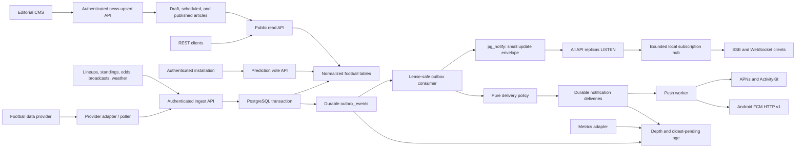

# Architecture

## Reference review

The starting point was based on two local production backends, inspected without modifying either:

| Concern | Apollo backend | Honk backend | SSB decision |
|---|---|---|---|
| Process shape | Separate API, scheduler, and workers | One composed application | Start as a modular monolith; keep command/process boundaries explicit |
| Persistence | PostgreSQL, repository interfaces, SQL migrations, `SKIP LOCKED` work claiming | SQLite pool, typed queries, migrations, triggers | PostgreSQL repositories, embedded forward migrations, constraints, triggers only for invariant timestamps |
| Realtime | Background polling and Redis queues | Actor-isolated WebSocket gateway | PostgreSQL fanout across replicas plus bounded in-process SSE/WebSocket subscriptions |
| HTTP | Versioned routes and request IDs | Typed request context and centralized error serialization | Versioned `net/http` routes, context request IDs, one error envelope, recovery and timeouts |
| Operations | Docker, health endpoints, metrics/traces, pprof | Structured logging and test dependency injection | Non-root image, health/readiness, JSON `slog`, awaited graceful shutdown, vendor-neutral metrics seam |
| Testing | Domain and repository tests | Application-level and WebSocket tests | Fast domain/HTTP tests plus real-PostgreSQL migration, ordering, version, and lease tests in CI |

Important improvements over simply copying either repository:

- every HTTP timeout is explicit;
- shutdown uses a fresh bounded context rather than an already-cancelled process context;
- readiness checks the database while liveness does not;
- proxy headers are not trusted implicitly;
- ingestion authentication uses constant-time comparison and is required in production;
- migrations are checksummed and serialized with a PostgreSQL advisory lock;
- match writes, match events, and one durable versioned outbox record share one transaction;
- pagination is keyset-based rather than offset-based.
- canonical football rows are provider-neutral and provider IDs live in `external_ids`;
- reconnecting realtime listeners reconcile versions for every actively subscribed match;
- public reads support ETag revalidation and CDN caching.

## Runtime data flow

Provider-specific clients do not belong in the domain or HTTP transport. They should translate upstream payloads into normalized ingest commands, retain raw payloads in cheap object storage when replay/audit is needed, and record provider cursors in `ingestion_cursors`.

The normalized odds, broadcast, weather, lineup, statistics, officials, and standings APIs are not themselves data sources. A production deployment must select upstream vendors and run credentialed adapters that feed these endpoints, with provider-specific quota handling, retries, cursor advancement, freshness monitoring, and replay kept outside the core API process.

## Boundaries

- `internal/domain/football`: normalized types, filters, commands, validation, and repository contracts.
- `internal/domain/news`: editorial article types, public-feed filters, publication states, and repository contracts.
- `internal/service`: use cases and policy; no HTTP or SQL knowledge.
- `internal/repository/postgres`: SQL and transaction implementation.
- `internal/transport/httpapi`: JSON contracts, routing, middleware, SSE.
- `internal/realtime`: cross-replica notification listener and local subscriber hub.
- `internal/eventing`: transactional outbox claiming and post-commit publication orchestration.
- `internal/notification`: platform-neutral models and pure match-to-delivery policy.
- `internal/push`: platform-neutral delivery worker plus APNs/ActivityKit and FCM adapters.
- `internal/maintenance`: bounded retention scheduling.
- `internal/observability`: vendor-neutral metrics contract and queue-health monitor.
- `migrations`: schema plus the embedded migration runner.

## Scaling path

1. Scale stateless API instances behind a load balancer. Each replica owns one direct PostgreSQL listener connection.
2. Run provider adapters independently with jitter, provider-aware quotas, retries, and cursor checkpoints.
3. Add read replicas only for queries tolerant of replication lag. Live match reads should remain on primary or a low-lag topology.
4. Extend the existing outbox publisher to Kafka/NATS when consumers need durable delivery outside PostgreSQL. Do not dual-write from request handlers.
5. Add Redis only for measured hot-key caching or distributed rate limits. Live state remains reconstructible from PostgreSQL.
6. Partition `match_events` by kickoff season or time only after table/index measurements show it is needed.

## Immediate next milestones

1. Add a provider adapter and catalog ingestion commands for leagues, seasons, teams, people, rosters, and fixtures.
2. Generate an OpenAPI 3.1 contract and SDK fixtures once mobile/web client requirements settle.
3. Replace the separate editorial API key with staff identity, role-based authorization, and an audit trail when a first-party CMS is introduced.
4. Add a Prometheus or OpenTelemetry implementation of the existing metrics interface with explicit cardinality budgets and service-level objectives.
5. Add catalog ingestion plus data-quality reconciliation and correction/replay workflows around the existing match-coverage replacement API.
6. Add ActivityKit broadcast channels for large iOS audiences and evaluate FCM topics only where their latency profile fits.

## Mobile delivery model

Foreground live tracking is identical on iOS and Android: clients fetch a snapshot, connect to either SSE or WebSocket, and refetch by match ID/version when an update envelope arrives. The envelope is intentionally small and coalescible.

Background delivery uses one queue but separate adapters:

- iOS standard alerts use APNs `alert`; ActivityKit start/update/end requests use `liveactivity` and the `<bundle-id>.push-type.liveactivity` topic.
- Android uses FCM HTTP v1 with OAuth 2.0 application-default credentials, high priority only for user-visible score/status changes, a two-minute TTL, and per-match collapse keys.
- Provider responses invalidate stale tokens and retry only transient failures. Delivery IDs and versions make enqueueing idempotent.

For very large match audiences, add an ActivityKit broadcast-channel adapter to the existing outbox consumer rather than performing one APNs request per Live Activity token. Keep per-device delivery as the compatibility path. Android topics can reduce fanout cost, but direct tokens remain preferable for low-latency personalized subscriptions.
